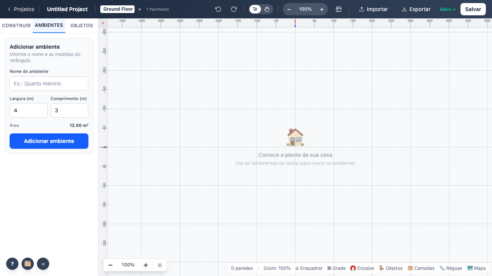

# 01 — Abertura do editor

Rota `/editor`. Sem `?id=`, cria um projeto novo, grava e corrige a URL com `history.replaceState`.

## Parâmetros

| Parâmetro | Valor | Onde vive | Observação |
|---|---|---|---|
| `?id=` | slug de 8 caracteres | URL | Ausente ou desconhecido → cria projeto novo |
| Nome inicial | `Untitled Project` | `createDefaultProject()` | ⚠️ ainda em inglês |
| Pavimento inicial | `Ground Floor`, nível 0 | `createDefaultFloor()` | ⚠️ ainda em inglês |
| Estado vazio | "Comece a planta da sua casa" | `FloorPlanCanvas` | Some quando existe parede, objeto ou porta |
| Debounce do auto-save | 500 ms | `routes/editor/+page.svelte` | Com flush ao sair — ver achado 4 |

## Comportamento verificado

- Carrega sem nenhum erro de runtime no console.
- O canvas pinta o primeiro quadro (verificado por `getImageData`, não por captura).
- Recarregar com o mesmo `?id=` reabre o mesmo projeto.

**Teste:** `tests/e2e/01-abertura.spec.ts`
