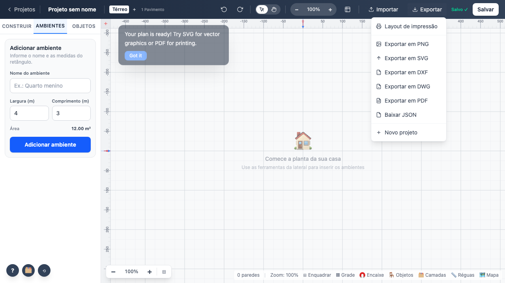
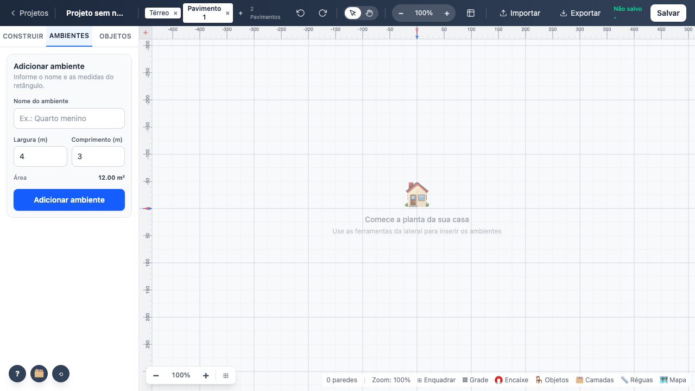
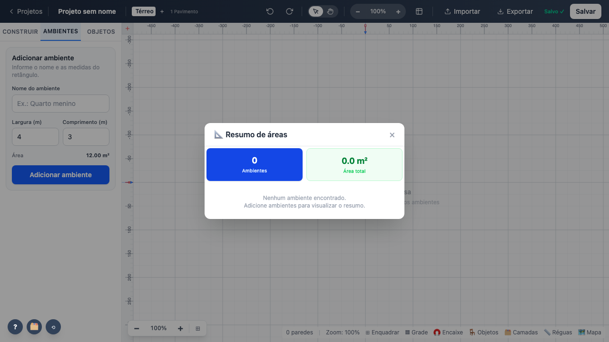

# 02 — Barra superior

`toolbar/TopBar.svelte` compõe: `SeletorPavimento`, `ControlesVisualizacao`, `MenuOverflow`,
`MenuExportar` e o diálogo de resumo de áreas.

## Parâmetros

| Parâmetro | Padrão | Faixa / opções | Persistência |
|---|---|---|---|
| Nome do projeto | `Projeto sem nome` | texto livre | `localStorage` (auto-save) |
| Pavimentos | 1 | ≥ 1 — o último não pode ser excluído | projeto |
| Zoom | 100 % | 10 % a 1000 %, passo ×1,25 | store `canvasZoom` |
| Modo do ponteiro | Selecionar | Selecionar \| Mão | store `panMode` |
| Estado de salvamento | `Salvo ✓` | Salvando… \| Salvo ✓ \| Não salvo • | `saveStatus` |

## Comportamento verificado

- Renomear grava no projeto.
- Adicionar pavimento atualiza o contador ("1 Pavimento" → "2 Pavimentos") e o botão de excluir
  só aparece a partir do segundo.
- Zoom aproxima, afasta e volta a 100 % clicando no percentual.
- O menu Exportar lista os 8 itens e fecha ao clicar fora.

**Teste:** `tests/e2e/02-barra-superior.spec.ts`
