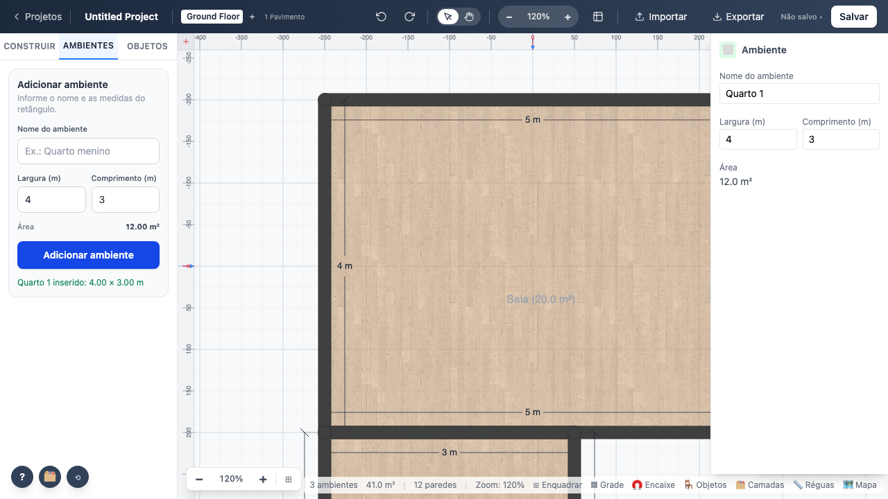
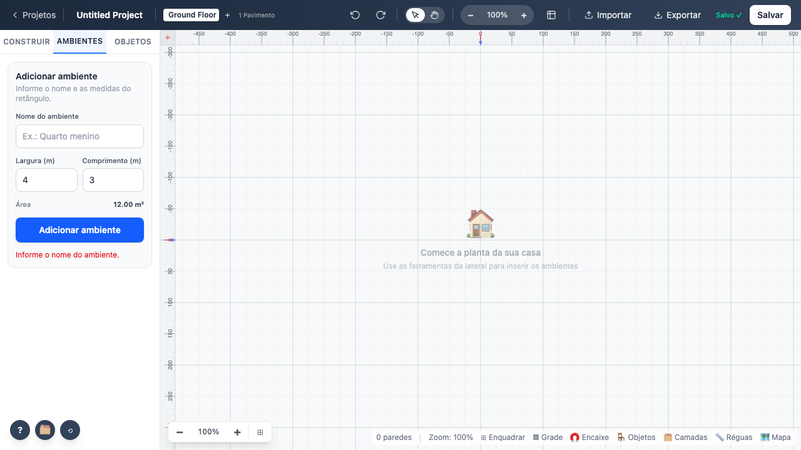
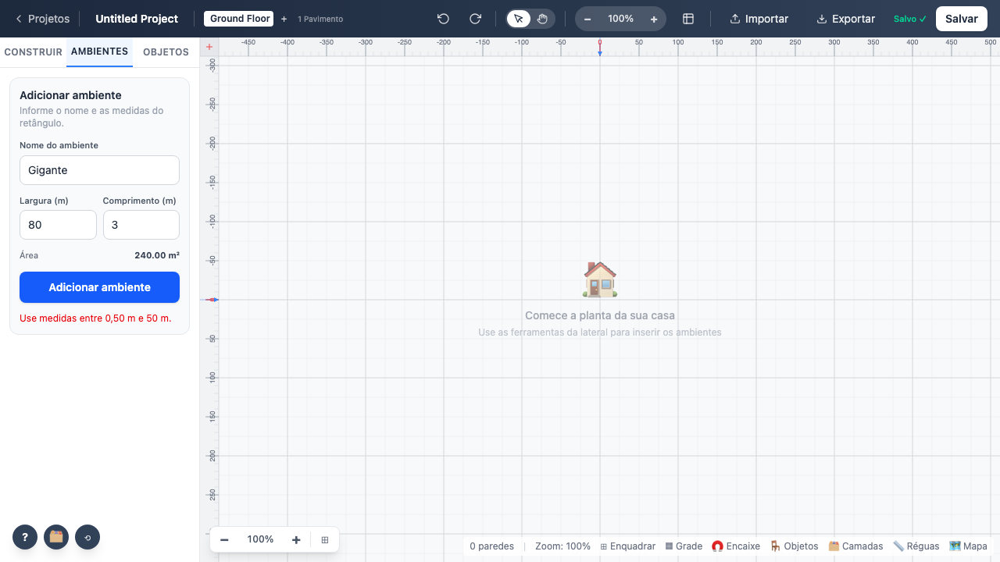

# 03 — Inserção de ambientes

`sidebar/build/AbaAmbientes.svelte`. Insere um retângulo de 4 paredes e procura posição livre com
`utils/ambientes/posicionamento.ts`.

## Parâmetros

| Parâmetro | Padrão | Faixa | Mensagem no limite |
|---|---|---|---|
| Nome do ambiente | vazio | 1 a 60 caracteres | "Informe o nome do ambiente." |
| Largura (m) | 4 | 0,5 a 50 | "Use medidas entre 0,50 m e 50 m." |
| Comprimento (m) | 3 | 0,5 a 50 | idem |
| Área | calculada | — | atualiza ao digitar, antes de inserir |

Medidas são digitadas em **metros** e guardadas em **centímetros** (`× 100`).

## Comportamento verificado

- Inserir cria exatamente 4 paredes e 1 ambiente com a área correta (3 × 2,5 → 7,5 m²).
- Confirmação aparece com as medidas: "Sala inserido: 5.00 × 4.00 m".
- Três ambientes seguidos ficam **sem sobreposição** (verificado comparando as caixas
  delimitadoras, não visualmente).
- O formulário volta aos padrões (4 × 3) depois de inserir.

**Teste:** `tests/e2e/03-ambientes.spec.ts`
