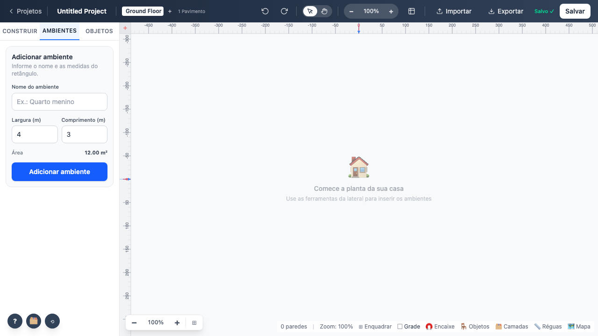
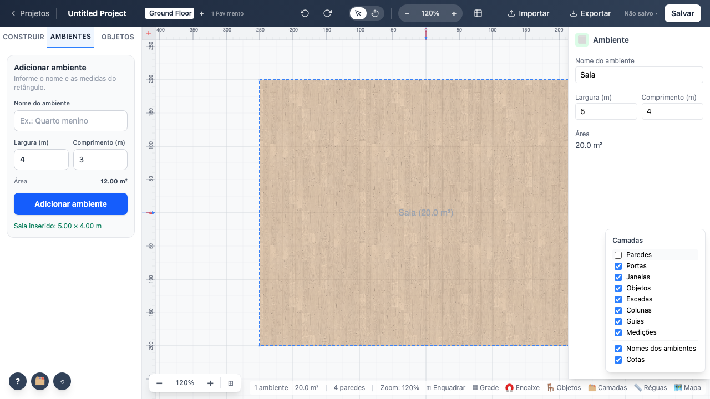
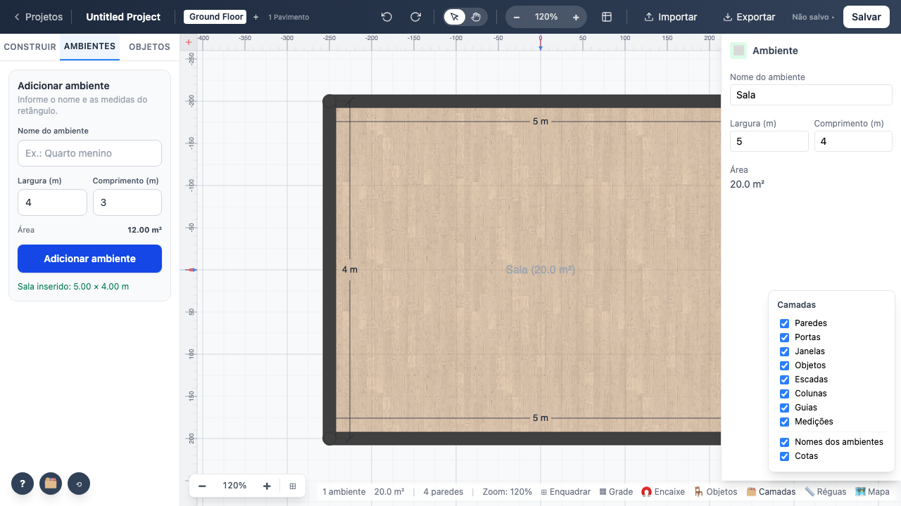

# 04 — Canvas

`editor/FloorPlanCanvas.svelte` com os sobrepostos em `editor/canvas/*`. Desenho em
`utils/renderizador/`.

## Parâmetros

| Parâmetro | Padrão | Onde alterna | Observação |
|---|---|---|---|
| Grade | ligada | barra de status, tecla `G` | ver achado 1 |
| Réguas | ligadas | barra de status | 24 px de espessura |
| Minimapa | ligado | barra de status | só renderiza com ≥ 1 parede |
| Encaixe na grade | ligado | barra de status, tecla `S` | passo de 25 cm |
| Camadas | todas visíveis | painel de camadas | 8 camadas + nomes + cotas |
| Zoom pela roda | — | roda do mouse | passo fixo por evento, ancorado no cursor |
| Enquadrar | — | `F` ou ⊞ | ajusta zoom e câmera ao projeto |

**1 unidade de mundo = 1 cm.** A tolerância de clique escala com o zoom.

## Comportamento verificado

- Roda do mouse aproxima e afasta, ancorando no cursor.
- `F` enquadra e muda o zoom.
- Alternar grade, réguas ou uma camada muda a quantidade de tinta no canvas — medido por
  `getImageData`, então testa o desenho de verdade, não só a classe CSS.
- Arrastar com a ferramenta mão move a vista.
- O minimapa aparece e some junto com as paredes.

**Teste:** `tests/e2e/04-canvas.spec.ts`
