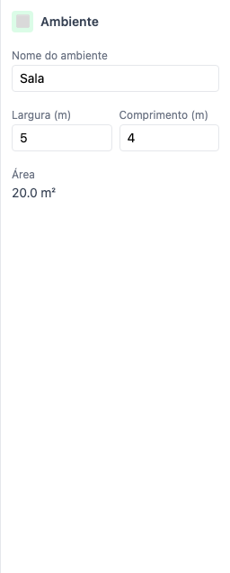
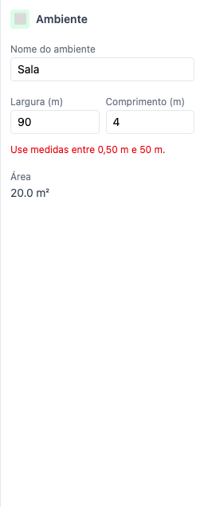

# 05 — Painel de propriedades

`sidebar/PropertiesPanel.svelte` despacha para um componente por tipo de elemento em
`sidebar/propriedades/`. Fica escondido (`class:hidden`) enquanto não há seleção.

## Painéis por tipo

| Tipo | Componente | Parâmetros |
|---|---|---|
| Parede | `PropriedadesParede` | espessura, curvatura |
| Porta | `PropriedadesPorta` | largura, distância das duas pontas, altura, tipo, dobradiça, sentido |
| Janela | `PropriedadesJanela` | tipo, largura, distâncias, altura, peitoril |
| Objeto | `PropriedadesEquipamento` | cor, largura, profundidade, altura, material, rotação, espelhar, travar |
| Ambiente | `PropriedadesAmbiente` | nome, largura, comprimento, área |
| Escada | `PropriedadesEscada` | tipo, largura, profundidade, degraus, sentido, rotação |
| Coluna | `PropriedadesColuna` | formato, diâmetro/lado, altura, cor, rotação |
| Texto | `PropriedadesTexto` | conteúdo, tamanho, cor, rotação, X, Y |
| Imagem de fundo | `PropriedadesImagemFundo` | opacidade, escala, rotação, travar, escala por calibragem |

## Parâmetros do ambiente

| Parâmetro | Faixa | Unidade exibida | Guardado como |
|---|---|---|---|
| Nome | texto livre | — | `Room.name` |
| Largura | 0,5 a 50 | m (métrico) / in (imperial) | cm |
| Comprimento | 0,5 a 50 | idem | cm |
| Área | somente leitura | m² com 1 casa | m² |

Toda medida passa por `propriedades/unidades.ts`. Nenhum painel escreve "cm" fixo — o rótulo sai
de `rotuloUnidade()`, porque o usuário pode estar em imperial.

## Comportamento verificado

- O painel fica escondido sem seleção e aparece ao inserir um ambiente.
- Renomear grava no projeto.
- Redimensionar de 5 × 4 para 7 × 4 atualiza a área para 28,0 m².
- Medida fora da faixa é recusada com mensagem, sem alterar o ambiente.
- Girar 90° troca largura por comprimento.
- ⚠️ O botão de girar só aparece depois de clicar no ambiente na planta — ver achado 6.

**Teste:** `tests/e2e/05-propriedades.spec.ts`
