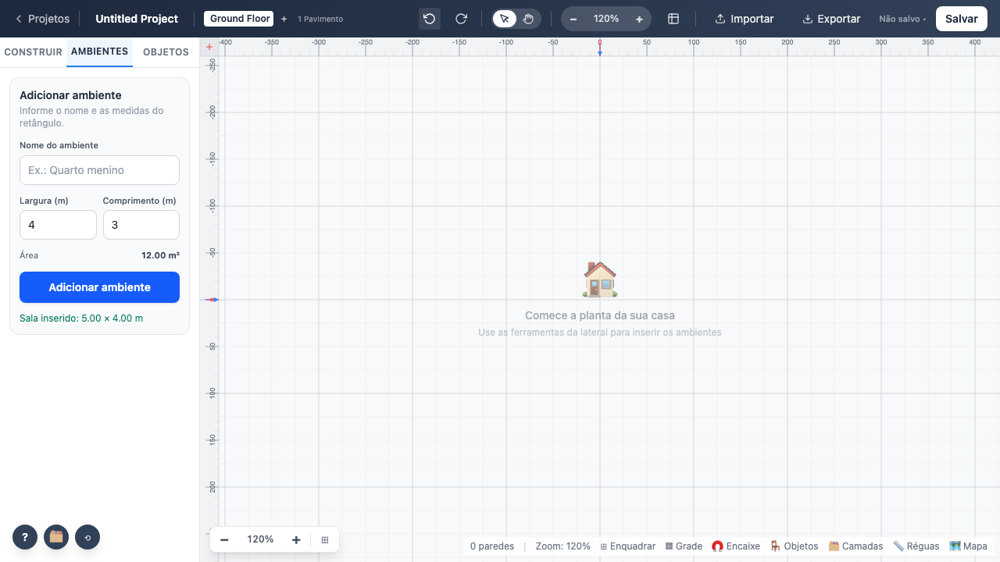
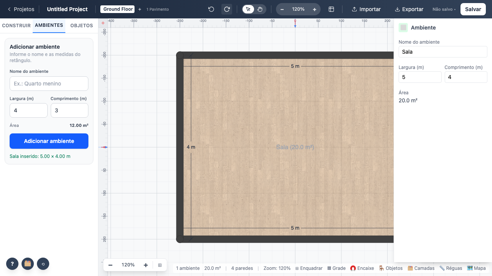

# 06 — Desfazer e refazer

`stores/project/historico.ts`. Toda alteração do projeto passa por `mutate`, que tira um snapshot
antes de aplicar.

## Parâmetros

| Parâmetro | Valor | Observação |
|---|---|---|
| Atalhos | `Ctrl+Z` / `Ctrl+Y` / `Ctrl+Shift+Z` | também nos botões da barra superior |
| Agrupamento por digitação | `coalesceKey` | teclas seguidas no mesmo campo viram 1 entrada |
| Agrupamento explícito | `beginUndoGroup()` / `endUndoGroup()` | usado em remoção em cascata |
| Arrasto | `beginDrag()` … commit | só registra se houve deslocamento ≥ 3 px — ver achado 3 |

## Comportamento verificado

- Desfazer remove o ambiente inserido; refazer devolve.
- Os atalhos de teclado funcionam com o foco no canvas.
- **Renomear pelo painel gera UMA entrada**, não uma por tecla: digitar "Cozinha" sobre "Sala" e
  desfazer uma vez devolve "Sala" inteiro.
- Com dois ambientes, desfazer remove o último e preserva o primeiro.

**Teste:** `tests/e2e/06-historico.spec.ts`
