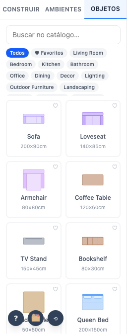
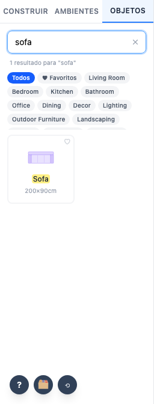
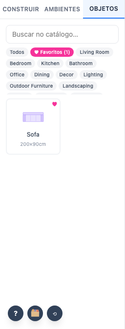
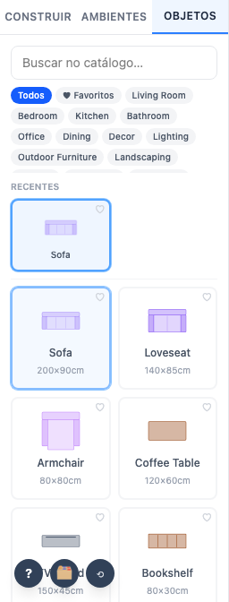

# 07 — Painel de construção

`sidebar/BuildPanel.svelte` com três abas em `sidebar/build/`.

## Abas

| Aba | Componente | Conteúdo |
|---|---|---|
| Construir | `AbaAberturas` | 8 tipos de porta, 5 de janela |
| Ambientes | `AbaAmbientes` | formulário de inserção (ver área 03) |
| Objetos | `AbaObjetos` | catálogo, busca, categorias, recentes, favoritos |

## Parâmetros

| Parâmetro | Padrão | Onde persiste |
|---|---|---|
| Aba ativa | Ambientes | memória (não persiste) |
| Categoria | Todos | memória |
| Busca | vazia | memória |
| Recentes | vazio | `localStorage` `o3d_recent_furniture`, máx. 10 |
| Favoritos | vazio | `localStorage` `o3d_favorite_furniture` |

## Miniaturas

Geradas por `utils/catalogThumbnails.ts` a partir do **mesmo símbolo 2D** desenhado na planta,
num canvas offscreen, e devolvidas como `data:image/png;base64`. Sem rede, sem WebGL, sem arquivo
de modelo — verificado no teste conferindo o prefixo do `src`.

## Comportamento verificado

- Escolher uma porta marca o cartão e ativa a ferramenta.
- A busca filtra e mostra a contagem; limpar restaura a lista.
- Favoritar move o item para a categoria Favoritos e **sobrevive ao recarregar**.
- Usar um objeto o coloca na seção Recentes.
- Filtrar por categoria reduz a lista.
- ⚠️ Nomes de categoria ainda em inglês — ver achado 7.

**Teste:** `tests/e2e/07-catalogo.spec.ts`
