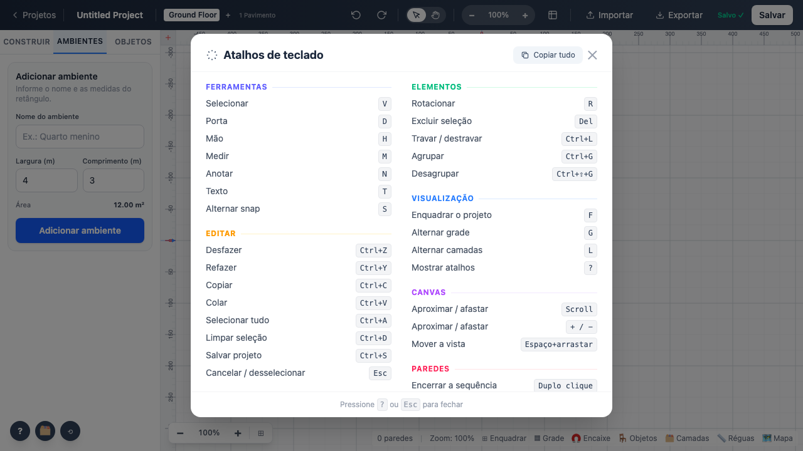
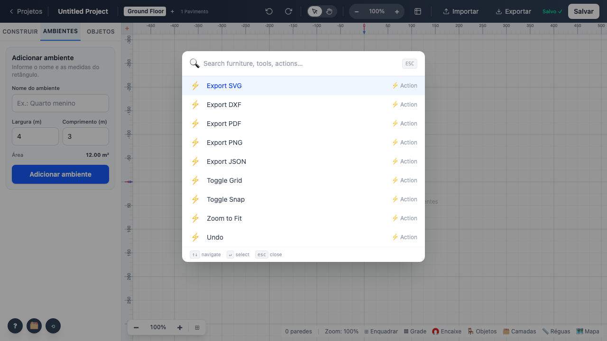

# 08 — Persistência, exportação e atalhos

## Persistência

Não há backend. `services/datastore.ts` grava em `localStorage`.

| Chave | Conteúdo |
|---|---|
| `floorplan_projects` | mapa `id → projeto serializado` |
| `floorplan_thumb_<id>` | miniatura do projeto |
| `o3d_settings` | unidades, cotas, grade |
| `o3d_recent_furniture`, `o3d_favorite_furniture` | preferências do catálogo |

- Auto-save com debounce de **500 ms**, mais gravação imediata em `beforeunload`, `pagehide` e
  `visibilitychange` (ver achado 4).
- `localStore.save()` trata `QuotaExceededError` — a cota do navegador é de poucos MB.
- `localStore.load()` é o **ponto único de migração de esquema**.

## Exportação

| Formato | Módulo | Verificado |
|---|---|---|
| PNG | `exportacao/png.ts` | baixa arquivo |
| SVG | `exportacao/svg.ts` | baixa arquivo |
| PDF | `exportacao/pdf.ts` | baixa arquivo |
| JSON | `exportacao/json.ts` | baixa e **o conteúdo tem o ambiente e as 4 paredes** |
| DXF / DWG | `utils/cadExport.ts` | baixa arquivo |

SVG, PDF, DXF e DWG têm desenho próprio, independente do canvas: elemento novo precisa ser
tratado em cada um.

## Atalhos

| Atalho | Ação | Verificado |
|---|---|---|
| `?` | abre a lista de atalhos | sim |
| `Esc` | fecha a lista | sim (era regressão — achado 5) |
| `Ctrl+K` / `/` | paleta de comandos | sim |
| `Ctrl+P` | layout de impressão | — |
| `F` `G` `S` `L` `M` `N` | enquadrar, grade, encaixe, camadas, medir, anotar | grade e camadas |

A lista completa é gerada de `utils/atalhosTeclado.ts` — fonte única para o overlay e para o
botão "Copiar tudo".

**Teste:** `tests/e2e/08-persistencia-exportacao.spec.ts`
